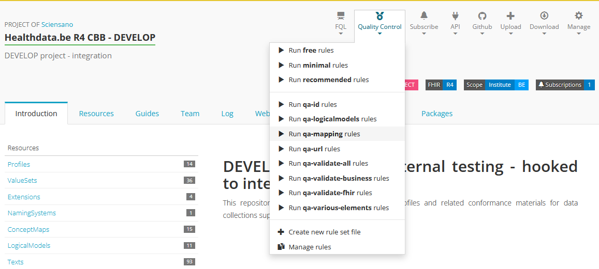

# Healthdata.be FHIR R4 CBB specs

This repository contains HL7 FHIR R4 compliant profiles and related conformance materials for the Clinical Building Blocks (CBB) supported by healthdata.be (Sciensano) based on the zibs 2020 release.

## Official releases

Resources in this repository should be considered unstable and not suited for immediate implementation. Stable versions will be released using the FHIR package mechanism on [Simplifier](https://simplifier.net/packages). At the moment, no package has been released for the current project.

## Profiling guidelines

The profiling guidelines for this project can be found in `profiling-guidelines.md`.

## Git workflow
### Branching strategy during development
Healthdata.be uses the following branching strategy during initial development:
* The main branch holds artifacts that have gone through the entire process, pass all quality assurance tests and are deemed ready for publication. 
* Development takes per information model (zib/cbb) within zib branches ("HdBe-[zib-name]", for example "HdBe-LaboratoryTestResult"). These branches:
    * are branched from main,
    * can be updated by merging main into the zib-branch at any time,
    * require a peer-reviewed pull-request before merging in main,
    * are deleted after merge in main, 
    * can be merged into integration at any time.  
* Multiple zibs may be included in one zib branch which can be convenient for zibs that are strongly related, like the medication-related zibs.
* The integration branch is linked to a Simplifier.net project which will render all resources and host an Implementation Guide. The integration branch is useful for quality control processes.

The following illustration visualizes how this workflow might look like
```
main
--x---x----------------+--x------------x------+-------
  |   |                |  |            |      |
  |   |  integration   |  |            |      |
  \---|-----------+----|--|------------|---+--|--------
      |           |    |  |            |   |  |  
      | HdBe-xxx  |    |  | HdBe--yyy  |   |  |
      \-----------/----/  \------------/---/--/
```

### Branching strategy after publication
Healthdata uses the following branching strategy:
* Releases correspond with the "stable-xxx" branches. These branches are only updated when there is a new release.
* Integration of fixes and features is done on integration branches, named "release-xxx", where "xxx" is the version number of the upcoming release. Integration branches are created for each new release cycle and deleted after they are merged to the "stable-xxx" branches.
* Development of fixes and features is done:
	* Hotfixes (typos etc.) are usually directly applied to the integration branch(es).
	* Larger issues are developed in topic branches. These issues are usually tracked in the GitHub repository issue tracker and the topic branches are named accordingly. Topic branches are merged into the integration branches when they are ready to be released. They are deleted after they are merged with all relevant integration branches.
	* _NOTE: version numbers of FHIR materials should not be changed as part of the development process. This should be part of the release process._

The following illustration visualizes how this workflow might look like
```
stable-1.x
-----x------------------x----------+--x-----------------
     |                  |          |  |
     | release-1.1.5    |          |  | release-1.1.6
     \----x-----------+-|----------/  \-----+-----------
          |           | |                   |
          | topic #50 | |   topic #57       |
          \-----------/  \------------------/
```
Things to note:
* Topic branches may be branched from a release branch (# 50) or a stable branch (# 57) at the developer's discretion.
* Topic branches may have a life cycle independent from the releases (# 57).


## Quality Assurance 

There are multiple (semi)-automatic checks incorporated to assure the quality of the deliverables. 


#### **1. Firely Terminal**

Firely terminal can be used to validate work locally. This is useful when you want to check your work before committing it.

Open Powershell and navigate to the folder you want to validate. If you use the main folder `HdBe-FHIR-R4-CBB` it will validate the complete project.* Use the following command to validate your work with all quality assurance rules:

```
fhir check qa-validate-all
```

Depending on what your work contains, you can also use another validation file to focus on on a part of the validation. Inside the rules files is described what and how it is validated. The validation files are all in the main folder and comprise of the name `qa-*.rules.yaml`.

* When you choose for `qa-validate-FHIR.rules.yaml` as quality assurance, the focus is on validating if the project conforms the FHIR specifications, and if the examples are in accordance with the profiles. 
* When you choose for `qa-validate-business.rules.yaml` as quality assurance, the focus is on validating if the project meets the profiling guidelines. 

*<sub>Without the src folder<sub>


#### **2. Github Actions**

Every time commits are pushed to the GitHub environment in the main or integration branch, the Github Actions pipeline is started. The Github Actions pipeline is also started when a pull request is merged into the main branch.

GitHub Actions always validates the complete project and uses all quality assurance rules. 
It can be found within Github under the **Actions tab**. 

A merge to the main branch should only be executed when the pipeline was succesfully completed.


#### **3. Simplifier.net**

Within the project on Simplifier, the **Quality Control** can also be started. The rules on top are standardly provided, but the other rules are defined with this project.



As of now, Quality Assurance on Simplifier is still in Beta and is not as sensitive as the Terminal or GitHub Actions. However, this validator is the most interactive one, as you can directly go through the rules and files that are marked by the validator.


### Quality Assurance outcomes

Depending on what Quality Assurance rules are chosen, there could be various results. Errors or warnings usually contain the file name and an explanation of the issue. 

To expand when this will be used more.


### How to set up Quality Assurance


To do...